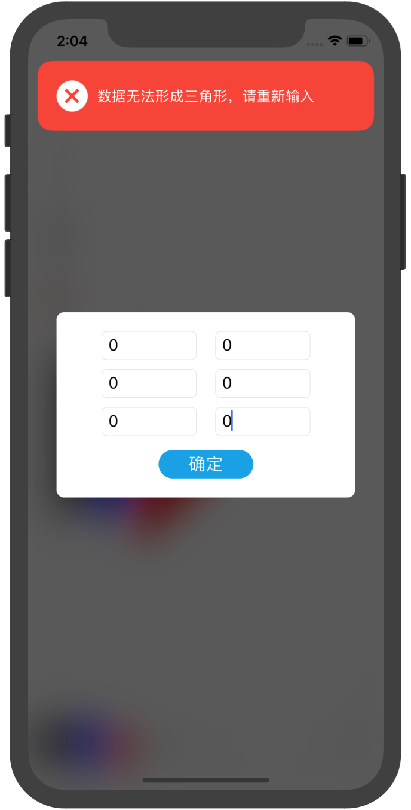

# 手机画图软件实现报告

[TOC]

## 一、需求描述与分析

### 1. 需求描述

  编写程序，实现手机图形设计工具软件。具体需求如下：

- 可以通过交互输入点坐标，进而不断构造线段与三角形，可以给线段和三角形指定颜色。
- 可以删除线段或三角形。
- 可以将通过上面设计得到的线段或三角形保存到一个文本文件中。
- 可以正确打开前面保存的文本文件，得到线段与三角形。
- 要求采用图形界面，所见即所得。

### 2. 需求分析

  本项目基于iOS平台，实现上述功能的同时，借助于移动平台的触控友好性，加入了触摸绘制的功能。现对上述需求做明确的功能定义，以便于后续的功能实现和评估。

- 通过四个输入框输入两个点的x坐标和y坐标画线，并对输入的坐标进行屏幕边界进行检测，如果不合法提示错误。
- 通过六个输入框输入三个点的x坐标和y坐标画三角形，对三角形的形成条件和屏幕边界进行检测，如果不合法提示错误。
- 画线段的操作方式为点击屏幕开始画线，手指不松开，在屏幕上拖动到终点后松开，即可画出线段。
- 画三角形的操作方式为点击屏幕开始画线，手指不松开，在屏幕上拖动到终点后松开，画出一条线段，再次点击屏幕，手指不松开，拖动到第三个点处即可画出三角形。
- 可以选择颜色，对三角形和线段进行上色。
- 可以选择三种颜色作为常用颜色，便于切换。
- 可以切换画笔粗细。
- 可以查看所有绘制的图形，并可以选择删除。
- 可以进行撤销和重做操作。
- 可以将绘制内容导出为JSON文本文件。
- 可以将导出的JSON文本文件导入，显示出文件中绘制的图形，并可以对它进行之前的操作。
- 可以清空当前画板。

## 二、开发环境配置

### 1. 概述

  本项目使用 Xcode 10.2.1 开发，使用Swift 5.0语言在iOS系统实现，可以在 iOS 12及以后的系统版本上运行，其中Xcode需要运行在macOS系统之上，本项目开发设备为 MacBook Pro 13' 2015 early，调试和运行设备为iPhone 11和iPad Pro 9.7'，本项目适配运行iOS系统的各种设备，包括但不仅限于 iPhone（4英寸之上）、iPad和iPod Touch。

## 2. 环境配置及项目运行

(1) 打开macOS的App Store，搜索 Xcode，下载最新版本的Xcode，按照说明安装即可，打开 Xcode，按照提示安装Command Line Tools。

(2) 安装iOS的包管理工具CocoaPods（按照 https://cocoapods.org/ 的说明）。

> ```bash
> sudo gem install -n /usr/local/bin cocoapods
> pod setup
> ```

(3) 使用终端（Terminal）切换到项目的根目录，输入pod install，安装第三方包的依赖。

> ```shell
> git clone https://github.com/Halcao/Painter.git
> cd Painter
> pod install
> open Painter.xcworkspace
> ```

(4) 打开 Painter.xcworkspace，选择要运行的模拟器，点击Xcode导航栏的运行按钮会开始编译项目，当项目编译链接构建完成之后，将会自动启动模拟器。

## 三、项目实现

### 1. 项目架构

  MVC模式（Model–View–Controller）是软件工程中的一种软件架构模式，把软件系统分为三个基本部分：模型（Model）、视图（View）和控制器（Controller），最早由Trygve Reenskaug在1978年提出，是施乐帕罗奥多研究中心（Xerox PARC）在20世纪80年代为程序语言Smalltalk发明的一种软件架构。MVC模式的目的是实现一种动态的程序设计，使后续对程序的修改和扩展简化，并且使程序某一部分的重复利用成为可能。除此之外，此模式通过对复杂度的简化，使程序结构更加直观。软件系统通过对自身基本部分分离的同时也赋予了各个基本部分应有的功能。专业人员可以通过自身的专长分组：

- 控制器（Controller）- 负责发起请求，对请求进行处理，处理图形界面时间响应，负责将数据变更更新到试图上 。
- 视图（View） - 界面设计人员进行图形界面设计。
- 模型（Model） - 程序员编写程序应有的功能（实现算法等等）、数据库专家进行数据管理和数据库设计(可以实现具体的功能)。


  本项目基于MVC架构实现，文件目录为：

```tree
├── Painter
│   ├── Assets.xcassets                             项目资源文件
│   ├── Common			                            项目助手类
│   │   ├── AppDelegate.swift                       应用入口
│   │   └── Extensions.swift                        Swift Class Extension
│   ├── Info.plist                                  项目描述文件
│   ├── Model                                       MVC-Model
│   │   └── DrawingModels.swift                     绘制属性对象
│   ├── View                                        MVC-View
│   │   ├── LineInputView.swift						线段输入框视图
│   │   ├── PainterViewController.xib               主界面视图
│   │   └── TriangleInputView.swift                 三角形输入框视图
│   └── ViewController                              MVC-Controller
│       ├── ColorPickerViewController.swift			选色控制器
│       ├── LayerTableViewController.swift			图层管理控制器
│       └── PainterViewController.swift				画板主控制器
├── Painter.xcodeproj                               工程文件
├── Painter.xcworkspace                             整合了第三方库的工程文件
├── Podfile                                         第三方库列表
├── Podfile.lock                                    已安装的第三方库状态
└── Pods                                            第三方库目录
```

### 2. 前提知识

#### (1) UIKit

  UIKit框架是iOS App的必需的基础结构，它提供了用于实现App界面窗口和视图的体系结构，可以向App提供多点触控和其他类型的输入的事件处理手段，以及管理用户、系统和App之间的交互所需的RunLoop（主运行循环）。 该框架还提供包括动画支持、文档支持、绘图和打印支持，当前设备的信息、文本管理和显示、搜索、可访问性支持、应用程序扩展支持以及资源管理等。

  UIKit为了提供上述问题拥有庞大复杂的体系结构和设计逻辑，但主要遵循MVC模式，以及广泛应用委托代理、数据源等设计模式。其中在我们的日常使用中，最离不开的就是UIViewController和UIView，分别是App中的每一个单页和每个界面元素。

##### UIView

  UIView表示屏幕上的一块矩形区域，负责与渲染区域的内容，并且响应该区域内发生的触摸事件。iOS App中几乎所有的可视化控件都是UIView的子类。

  UIView的任务有：

- 绘制和动画
- 布局和子视图管理
- 事件处理

##### UIViewController

  UIViewController顾名思义是MVC设计模式中的Controller部分，在UIKit中的主要功能是用于控制画面的切换，其中view属性（UIView类型）管理整个视图的外观。在iOS中，只有继承了UIResponder对象才能接受并处理事件，UIViewController继承了该类，因此可以在UIViewController只能够处理以下事件：

```swift
// 开始触摸事件
func touchesBegan(Set<UITouch>, with: UIEvent?) 
// 触摸事件开始改变
func touchesMoved(Set<UITouch>, with: UIEvent?)
// 触摸事件结束
func touchesEnded(Set<UITouch>, with: UIEvent?)
```

  我们可以在这些事件中添加代码，实现自己的业务逻辑。

#### (2) CALayer

  CALayer在概念和UIView类似，也是一些被层级关系树管理的矩形块，可以包含图片、文字、背景色等内容。和UIView的最大不同是不能够处理与用户的交互。

  每一个UIView都有个CALayer实例的图层属性，被称为*backing layer*，由视图负责创建并管理这个图层，UIView之所以能够显示，就是因为里面的该图层。CALayer是UIView的内部实现细节。

#### (3) CAShapeLayer

  CAShapeLayer继承自CALayer，可使用CALayer的所有属性。CAShapeLayer是一个通过矢量图形而不是bitmap来绘制的图层子类。可以指定诸如颜色和线宽等属性，用CGPath来定义想要绘制的图形，也可以配合UIBezierPath生成CGPath使用。

### 3. 具体设计

##### 画图

  UIBezierPath可以生成贝塞尔曲线、其他类型的线和图形，通过以下几个API进行操作：

```swift
// 移动绘制起始点
func move(to: CGPoint)
// 添加从当前点到某点的线段
func addLine(to: CGPoint)
// 闭合路径
func close()
```

  对于线段的绘制，我们可以搭配`move(to: startPoint)`函数和`addLine(to: endPoint)`实现；对于三角形的绘制，我们可以通过`move(to: firstPoint)`函数、`addLine(to: secondPoint)`、`addLine(to: thirdPoint)`、`close()`实现。

  对于颜色的绘制，可以通过设置CAShapeLayer的属性`strokeColor`（轮廓线颜色）、`fillColor`（填充颜色）来实现。

  对于画笔粗细的控制，可以通过设置CAShapeLayer的属性`lineWidth`（线宽来实现）。

##### 管理

  因为CALayer使用的可递归的层级显示，意味着可以给图层添加CALayer类的子图层（sublayer属性），可以通过管理CALayer的sublayers属性的方式对图层进行管理，从而实现撤销、重做、删除图案。

##### 导入导出

  导出这一步操作，主要目的是为了记录之前的操作和信息。对于CAShapeLayer的信息，主要为：

- `lineWidth`属性
- `strokeColor`属性
- `fillColor`属性
- `path`属性

  考虑到`path`属性不便于序列化和反序列化，因此将记录`path`属性中关键点，即各个点的`x`和`y`的坐标，将各点的坐标放进`points`数组里；将颜色类型的属性的RGB值取出，拼接成为逗号分隔的字符串存储。将每个CAShapeLayer的各个属性取出之后按照JSON数组的格式保存，示例格式为：

```json
// 以下数据表示一条线段和一个三角形
[{
    "lineWidth": 1.0,
    "strokeColor": "130,250,55",
    "fillColor": "130,250,55",
    "points": [
        "120.0,130.0",
        "120.0,160.0"
    ]
}, {
    "lineWidth": 2.0,
    "strokeColor": "255,0,0",
    "fillColor": "255,0,0",
    "points": [
        "220.0,200.0",
        "200.0,220.0",
        "220.0,220.0"
    ]
}]
```

  如此操作之后，便可导出JSON表示的线段和三角形。

  导入操作也一样，将上述信息解析出来之后，构造CAShapeLayer，添加到`view.layer`上作为sublayer，即可恢复数据中记录的图形。

### 4. 绘图过程

  在[UIViewController](#UIViewController)的介绍中提到了触摸事件的函数。这些函数构成了一个状态机，起始状态为`touchesBegan`，中间状态为`touchesMoved`，接受状态为`touchesEnded`。

.png)

  我们在每个事件的响应函数中实现线段和三角形的绘制逻辑。

##### 线段

- `touchesBegan`
  1. 记录起点`startPoint`
  2. 新建CAShapeLayer图层`currentLayer`，并设置其风格（线宽、颜色）
  3. 将`currentLayer`显示到屏幕上
- `touchesMoved`
  1. 新建UIBezierPath变量`path`
  2. 调用`path.move(to: startPoint)`
  3. 记录下手指移动到的点`endPoint`
  4. 调用`path.addLine(to: endPoint)`
  5. 令`currentLayer.path = path`，更新路径
- `touchesEnded`
  1. 置空 `currentLayer `和`startPoint`变量，准备下次绘制

##### 三角形

- `touchesBegan`

  1. 如果`startPoint`为空，即正在绘制第一条边，则：
     1. 记`isDrawingFirstEdge`为true
     2. 记录起点`startPoint`
     3. 新建CAShapeLayer图层`currentLayer`，并设置其风格（线宽、颜色）
     4. 将`currentLayer`显示到屏幕上

  2. 如果`startPoint`为空，即正在确定第三个点，则：
     1. 记`isDrawingFirstEdge`为false

- `touchesMoved`

  1. 如果`isDrawingFirstEdge`为true，即正在绘制第一条边，则：
     1. 调用绘制线段的touchesMoved，按照绘制线段的流程，绘制一根跟着手指移动的线段，确定第二个点

  2. 如果`isDrawingFirstEdge`为false，即正在确定第三个点，则：
     1. 通过之前保存的`firstPath`（touchesEnd函数中定义）构造一个UIBezierPath对象path
     2. 记录下手指移动到的点`endPoint`
     3. 调用`path.addLine(to: endPoint)`
     4. 调用`path.close()`
     5. 令`currentLayer.path = path`，更新路径

- `touchesEnded`

  1. 如果`isDrawingFirstEdge`为true，即正在绘制第一条边，则：
     1. 记录下手指移动到的点`endPoint`
     2. 更新`startPoint`为`endPoint`
     3. 记录`currentLayer.path`为`firstPath`

  2. 如果`isDrawingFirstEdge`为false，即正在确定第三个点，则：
     1. 将`firstPath`、`startPoint`、`currentLayer`置空，准备下次绘制

  三角形绘制逻辑较为复杂，建议根据`PainterViewController.swift`中对应代码对照理解。

### 5. 设计模式

  设计模式是一套被反复使用、多数人知晓的、经过分类编目的、代码设计经验的总结。使用设计模式是为了可重用代码、让代码更容易被他人理解、保证代码可靠性、程序的重用性。在该项目的开发过程中，运用了一些iOS中常见的设计模式，如MVC设计模式、单例模式（Singleton）、委托设计模式（Delegate）。其中MVC设计模式已经在介绍过，在这里就略去不表。

#### 单例模式

  单例设计模式确保给定类只会存在一个实例，并且该实例有一个全局的访问点。它通常使用延迟加载来在第一次需要时创建单个实例。使用单例的好处是可以获得全局唯一的实例，也就意味着在任何类中都能访问到该实例，可以作为配置文件访问，也可以用来传递数据。

  在Painter App中，使用单例模式存储风格配置。

```swift
class DrawingConfig {
    // 单例对象
    static var shared = DrawingConfig()
	// 私有化构造函数，禁止在类外构造第二个实例
    private init() {}
    // 三个只读属性
    var fillColor: UIColor {
        get {
            return colors[selectedColor]
        }
    }
    var strokeColor: UIColor {
        get {
            return colors[selectedColor]
        }
    }
    var lineWidth: CGFloat {
        get {
            return sizes[selectedSize]
        }
    }
    var colors: [UIColor] = [.black, .blue, .red]
    var sizes: [CGFloat] = [2, 3, 4]
    // 选中的画笔尺寸下标
    var selectedSize = 0
    // 选中的颜色下标
    var selectedColor = 0
}
```

#### 委托设计模式

  委托是指给一个对象提供机会对另一个对象中的变化做出反应或者影响另一个对象的行为。即有两个对象参与处理同一个请求，接受请求的对象将请求委托给另一个对象来处理。虽然并不在23种常用的设计模式中，但委托设计模式在iOS中经常用到，Apple 在大多数 UIKit 类中使用这种方法： `UITableView`， `UITextView`， `UITextField`， `UIWebView`， `UICollectionView`， `UIPickerView`， `UIGestureRecognizer`， `UIScrollView`。 这个清单还将不断更新。

  本项目使用到的委托模式主要在图层管理的表视图UITableView上，UITableView想要展示数据的话需要设置一个实现`UITableViewDataSource`的属性`dataSource`，该协议有以下三个方法：

```swift
// 返回section的数量
func numberOfSections(in tableView: UITableView) -> Int
// 返回参数中section对应的row的数量
func tableView(_ tableView: UITableView, numberOfRowsInSection section: Int) -> Int
// 返回参数中indexPath(section, row)对应的UITableViewCell
func tableView(_ tableView: UITableView, cellForRowAt indexPath: IndexPath) -> UITableViewCell
```

  也就是通过实现该协议的对象提供tableView需要展示的信息，前两个函数是section和row的数量，最后一个函数是提供显示在对应位置的控件UITableViewCell。

## 四、项目展示

- 运行在iPhone Xs上 - 画图界面

  

- 图层管理界面

  


- 坐标输入绘制三角形

  


- 颜色选择界面 （双击画笔唤出）

  

- 运行在iPad Pro 11'上 - 画图界面


## 五、不足与改进

- 本项目只能画线段和三角形，后续可以添加上画曲线和圆等其他图形的功能。
-  本项目使用Apple提供的UndoManager实现撤销重做操作，在实测中存在一些问题 ，后续可以通过手动管理layers数组实现，会更高效，保证操作质量。
- 不知为何切换画笔会比较慢。
- 图层管理处，各图层的缩略图比较小，后续可以裁剪白边。